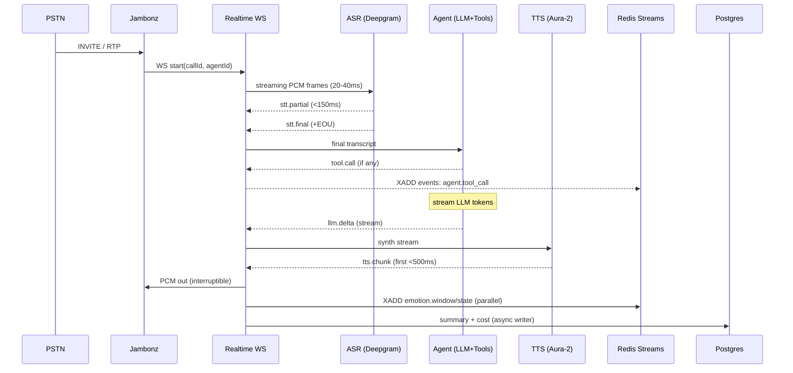
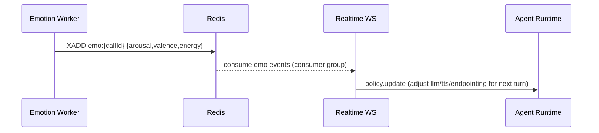

# Software Requirements Specification (SRS)

**Project:** Invorto Voice AI Agent Platform (One‑Phase GA Plan)

**Version:** 1.4\
**Date:** 21 Aug 2025 (IST)\
**Owner:** Invorto AI\
**Region:** AWS ap‑south‑1 (Mumbai)

---

## 0. Revision History

| Version | Date       | Author          | Notes                            |
| ------- | ---------- | --------------- | -------------------------------- |
| 1.4     | 2025-08-21 | Invorto/ChatGPT | **Tool calling added (FR‑TC1…TC10)**; webhook + timeline extended; schemaVersion bumped |
| 1.3     | 2025‑08‑21 | Invorto/ChatGPT | **Definitive vendor locks:** Supabase Postgres (managed) replacing RDS option; diagrams & deploy steps updated; webhook schemaVersion bumped |
| 1.2     | 2025‑08‑21 | Invorto/ChatGPT | Vapi parity fields; provider cost breakdown; assistant snapshot; destination; successEvaluation; webhook schemaVersion; cleanup dups |
| 1.1     | 2025‑08‑21 | Invorto/ChatGPT | One‑phase, definitive SRS for GA |

---

## 1. Introduction

### 1.1 Purpose

Deliver a production‑grade, low‑latency, multi‑tenant Voice AI platform in **one phase**. Includes telephony integration, real‑time ASR→LLM→TTS agent runtime, tool calling, SDKs, webhooks, dashboard, cost guardrails, observability, and emotion‑aware adaptation under feature flags.

### 1.2 Scope

- Inbound/outbound **SIP** via **Jambonz**; (optional) Browser WS client; WebRTC SFU deferred.
- Real‑time pipeline: **Deepgram ASR** → **OpenAI GPT‑4o‑mini** → **Deepgram Aura‑2 TTS** (defaults).
- **Native WebSockets** (binary PCM, 20–40 ms frames) for realtime.
- **Agent Runtime** with smart endpointing & barge‑in, JSON‑schema tools.
- **SDKs:** Node/TS server, Python, Browser WS realtime, Webhooks utils.
- **Data:** Redis (sessions/streams), Supabase Postgres (managed), S3 (recordings/transcripts/metrics).
- **Observability:** metrics, logs, traces, dashboards.
- **Compliance:** India DND/consent, PII redaction, ap‑south‑1 residency.
- **Emotion:** Energy + (optional) SER+NLP fusion; **feature‑flagged**, non‑blocking.
- **Costs:** All financial reporting & guardrails in **INR (₹)**.

### 1.3 Out of Scope (for GA)

- LiveKit/Pipecat/Daily
- WebRTC SFU dialer; Knowledge Base/RAG; self‑hosted LLM/ASR/TTS; ClickHouse analytics (may be added post‑GA).

### 1.4 Definitions & Abbreviations

- **ASR:** Automatic Speech Recognition.
- **TTS:** Text‑to‑Speech.
- **Barge‑in:** Stopping TTS when user starts speaking.
- **EOU:** End‑of‑Utterance (turn boundary).
- **SER:** Speech Emotion Recognition.
- **SLO/SLA:** Service Level Objective/Agreement.
- **TTL:** Time To Live.
- **WS:** WebSocket.

---

## 2. Overall Description

### 2.1 Product Perspective

```
PSTN/SIP ↔ Jambonz (Media GW) ↔ Realtime WS Gateway ↔ ASR ↔ Agent (LLM + Tools + Policy) ↔ TTS ↔ Jambonz
                                                   └── Redis Streams (events)
                                                   └── Postgres (ops data)
                                                   └── S3 (recordings/transcripts/metrics)
                                                   └── Webhooks → Tenant apps
                                                   └── Dashboard/SDKs
```

### 2.2 User Classes

- **Developers (Tenant):** Create agents, start calls, handle webhooks.
- **Supervisors/Analysts:** Review conversations, KPIs, spend, QA.
- **Ops/SRE:** Capacity, scaling, incidents, compliance.

### 2.3 Assumptions & Dependencies

- SIP trunks & numbers provisioned; AWS ap‑south‑1 available.
- Managed model providers reachable with low jitter; stable egress.
- Pricing/costing in **₹**; exchange rates configurable.

### 2.4 Constraints

- Hard latency budgets (see NFR).
- Regulatory compliance (TRAI/DoT DND, recording disclosure).
- One‑phase delivery: use **feature flags** for risky features.


### 2B. Bill of Materials (Definitive choices)
- **Cloud/Region:** AWS **ap-south-1** (Mumbai)
- **Media/Telephony:** **Jambonz** (self-hosted) with SIP trunks (Jio/Twilio, pluggable)
- **Realtime Gateway:** Custom WS service (Node/TS or Go) on **ECS Fargate**
- **ASR (streaming):** **Deepgram** Nova family
- **TTS (neural streaming):** **Deepgram Aura-2** (interruptible)
- **LLM (reasoning):** **OpenAI** `gpt-4o-mini` (tool use enabled)
- **State/Cache/Bus:** **Redis** (AWS ElastiCache) — keys/streams/locks
- **Relational DB:** **Supabase Postgres (managed)**
- **Object Store:** **Amazon S3** (encrypted, lifecycle rules)
- **IaC:** **Terraform**; **GitHub Actions** for CI/CD
- **Observability:** **OpenTelemetry** + CloudWatch; **Langfuse** for LLM tracing
- **Security:** AWS WAF, Secrets Manager, HMAC webhooks, JWT for WS

---

## 3. Functional Requirements (FR)

### 3.1 Telephony & Media IO

- **FR‑T1** Inbound SIP via Jambonz; bridge RTP → WS PCM (8/16 kHz).
- **FR‑T2** Outbound SIP; provider callbacks; call status updates.
- **FR‑T3** DTMF detection (RFC2833/INFO) surfaced as events.
- **FR‑T4** Audio frame policy: **20–40 ms**, mono PCM; single resample max.
- **FR‑T5** Jitter buffer (40–80 ms), packet‑loss concealment.
- **FR‑T6** Consent prompt injection before free speech; configurable.

### 3.2 Realtime Gateway & Protocol

- **FR‑R1** WebSocket endpoint `wss://api…/v1/realtime/:callId`; **JWT** or API key via header/`Sec‑WebSocket‑Protocol`.
- **FR‑R2** Binary frames for audio; heartbeat ping/pong (15 s); sticky sessions behind ALB/Nginx.
- **FR‑R3** Message types:

```json
// client→server
{ "t":"start", "callId":"c_123", "agentId":"a_1", "locale":"en-IN" }
{ "t":"audio", "seq":123, "pcm16": "<binary>" }
{ "t":"tool.result", "id":"tk-1", "result": {"ok":true} }
// server→client
{ "t":"stt.partial", "text":"I would like...", "ts":170.4 }
{ "t":"stt.final", "text":"I want pricing", "ts":171.9 }
{ "t":"llm.delta", "text":"Sure, our plans..." }
{ "t":"tool.call", "id":"tk-1", "name":"book_meeting", "args":{...} }
{ "t":"tts.chunk", "seq":201, "pcm16":"<binary>" }
{ "t":"control.bargein", "action":"stop-tts" }
{ "t":"emotion.window", "energy_db":-16.3, "speaking":true }
{ "t":"emotion.state", "class":"neutral", "arousal":0.3, "valence":0.0, "confidence":0.5 }
{ "t":"end", "reason":"hangup" }
```

### 3.3 ASR, LLM, TTS

- **FR‑A1** ASR streaming (Deepgram): partials < 150 ms; finals on EOU.
- **FR‑A2** LLM streaming (GPT‑4o‑mini): first tokens < 300 ms; function/tool call support.
- **FR‑A3** TTS streaming (Aura‑2): first audio < 500 ms; interruptible; pre‑warm on call start.
- **FR‑A4** Provider overrides per agent (ElevenLabs/Azure) via config; default Aura‑2.

### 3.4 Turn‑Taking & Endpointing

- **FR‑E1** Smart endpointing provider toggle: `invorto` (default) | `livekit` | `off`.
- **FR‑E2** Tunables: `silenceMs` (180–250), `minWords` (≥2), `confidenceThreshold` (0.6–0.7), `waitFunction` (e.g., `200 + 8000*x`).
- **FR‑E3** Barge‑in cutoff ≤ 150 ms; stop TTS immediately; preserve LLM stream.

### 3.5 Agent Runtime & Tools

- **FR‑G1** Agent config CRUD: prompt, voice, locale, interruptible, temperature, guardrails, end\_call rules.
- **FR‑G2** Tools defined with **JSON Schema**; secure invocation with timeouts/retries/idempotency locks.
- **FR‑G3** End‑of‑call summary + structured disposition (success, reason, next steps).
- **FR‑G4** Policy engine (see Emotion): dynamic knobs for LLM/TTS/endpointing.

### 3.6 Webhooks & Integrations

- **FR‑W1** Tenant‑registered HTTPS endpoint; HMAC SHA‑256 signatures.
- **FR‑W2** Events: `call.started`, `asr.final`, `agent.tool_call`, `agent.summary`, `call.ended`, `billing.usage.updated`, `qa.flags`.
- **FR‑W3** Retries (3× exponential); DLQ on failure.

### 3.7 SDKs & Specs

- **FR‑S1** SDKs: `@invorto/server` (Node/TS), `invorto` (Python), `@invorto/realtime` (Browser WS), `@invorto/webhooks`.
- **FR‑S2** Publish **OpenAPI (REST)** + **AsyncAPI (WS)**; versioned; SemVer.

### 3.8 Data & Storage

- **FR‑D1** Redis for sessions (TTL), Streams for events, rate limits, locks.
- **FR‑D2** Supabase Postgres (managed): tenants, agents, calls, event summaries, spend.
- **FR‑D3** S3: recordings (WAV/MP3), transcripts (JSON), metrics NDJSON.
- **FR‑D4** All costs & budgets in **INR (₹)**; per‑tenant caps.
- **FR‑D5** **Per‑provider cost breakdown** captured post‑call: `usage.costs[]` with `{type, provider, minutes|units, costInr}`; top‑level `usage.transportMinutes` and `usage.transportCostInr` included when telephony is used.

### 3.9 Emotion & QA (non‑blocking)

- **FR‑Q1** Energy meter (RMS→dBFS) every 250 ms; `emotion.window` events.
- **FR‑Q2** (Flagged) SER + text sentiment; fused `emotion.state` (arousal, valence, class).
- **FR‑Q3** Policy actions per label (frustrated/angry/confused/disengaged/positive) tuning LLM/TTS/endpointing for **next** turn.
- **FR‑Q4** QA flags: `frustration_spike`, `toxicity`, `overlap_risk`.

---

## 4. Non‑Functional Requirements (NFR)

### 4.1 Performance & Latency (p95 targets)

- **Call setup:** < 2.0 s after answer.
- **ASR first partial:** < 150 ms.
- **EOU detect:** 300–450 ms (short utterances).
- **LLM first token:** < 300 ms.
- **TTS first chunk:** < 500 ms.
- **User speak → bot speak:** **≤ 1.5 s** total.
- **Barge‑in cutoff:** ≤ 150 ms.

### 4.2 Scalability & Capacity

- 1,000 concurrent calls GA target; horizontal scale media + gateway; Redis in same AZ; async writers.
- Burst: 10k calls/hr for 5 min.

### 4.3 Reliability & Availability

- SLA 99.9% monthly (API + media).
- MTTR: Sev‑2 < 1h; Sev‑1 < 4h.
- Circuit breakers & provider failover.

### 4.4 Security & Privacy

- TLS 1.2+; JWT auth; HMAC webhooks; audit logs.
- PII redaction for transcripts; selective field masking.
- Secrets in AWS Secrets Manager; rotation 90d.
- RLS in Postgres; S3 SSE‑KMS; India data residency by default.

### 4.5 Observability

- Metrics: `asr_first_partial_ms`, `eou_ms`, `llm_first_token_ms`, `tts_first_chunk_ms`, `bargein_cutoff_ms`, `cost_per_call_inr`.
- Logs: structured JSON with call/turn IDs.
- Traces: OpenTelemetry spans per turn.
- Dashboards: live Energy graph, calls, spend.

### 4.6 Data Retention & Residency

- Recordings default 180d; transcripts 365d; configurable.
- Right‑to‑erasure workflow; purge ≤ 14 days.
- ap‑south‑1 at rest; cross‑region backups as per DR.

### 4.7 Accessibility & i18n

- en‑IN/Hinglish baseline; Hindi support via ASR/LLM locales; TTS voice selection per agent.
- Dashboard accessible (contrast, keyboard, ARIA labels).

---

## 5. System Architecture

### 5.1 Components

- **Jambonz Media GW:** SIP/RTP↔WS, VAD, DTMF.
- **Realtime WS Gateway:** binary WS, backpressure, heartbeats, auth.
- **ASR Adapter:** Deepgram streaming client.
- **Agent Runtime:** LLM orchestration, tool calling, endpointing, policy engine.
- **TTS Adapter:** Deepgram Aura‑2 with pre‑warm & caching.
- **Event Bus:** Redis Streams; sessions & rate limits in Redis.
- **Data Layer:** Supabase Postgres (managed), S3.
- **Webhooks Service:** signer/dispatcher with retries & DLQ.
- **Dashboard:** Supabase + Metabase (initial).
- **SDKs:** server, python, realtime, webhooks.

### 5.2 Deployment (AWS ap‑south‑1)

- **API/WS services:** ECS Fargate or EC2 ASG; ALB (WS upgrade).
- **Jambonz media:** EC2 with autoscale; NLB/ALB as needed.
- **Redis:** ElastiCache in same AZ; Multi‑AZ later.
- **DB:** Supabase Postgres (managed); PITR enabled.
- **Storage:** S3 with versioning & lifecycle rules.
- **Network:** VPC with private subnets; NAT for egress; SG least privilege; WAF on ALB.

### 5.3 Configuration & Feature Flags

```json
{
  "providers": { "asr":"deepgram", "llm":"openai-4o-mini", "tts":"aura-2" },
  "endpointing": { "provider":"invorto", "silenceMs":220, "minWords":2, "confidence":0.65, "waitFunction":"200 + 8000 * x" },
  "features": { "emotion": false, "providerOverride": true, "rag": false },
  "cost": { "currency":"INR", "rate_per_usd": 87 }
}
```

---

## 6. Data Model & Schemas

### 6.1 Postgres (core) — backed by Supabase Postgres

```sql
create table tenants(
  id uuid primary key, name text not null, created_at timestamptz default now()
);
create table api_keys(
  id uuid primary key, tenant_id uuid references tenants, hash text not null,
  role text check (role in ('admin','dev','analyst')), active boolean default true,
  created_at timestamptz default now()
);
create table agents(
  id uuid primary key, tenant_id uuid references tenants, name text,
  version int default 1, config jsonb not null,
  created_at timestamptz default now(), updated_at timestamptz default now()
);
create table calls(
  id uuid primary key, tenant_id uuid references tenants, agent_id uuid references agents,
  direction text, from_num text, to_num text, started_at timestamptz, ended_at timestamptz,
  status text, duration_sec int, cost_inr numeric(12,2) default 0
);
create table events(
  id bigserial primary key, call_id uuid references calls, ts timestamptz,
  kind text, payload jsonb
);
create materialized view call_stats as
select tenant_id, date_trunc('day', started_at) d, count(*) n_calls,
       sum(duration_sec) dur, avg(duration_sec) avg_dur, sum(cost_inr) cost_inr
from calls group by 1,2;
```

### 6.1.1 Billing Costs (per‑provider)

```sql
create table call_costs(
  id bigserial primary key,
  call_id uuid references calls on delete cascade,
  type text check (type in ('transport','stt','tts','llm','platform','other')) not null,
  provider text,
  minutes numeric(10,2),   -- for transport
  units numeric(12,2),     -- generic units (e.g., tokens, chars)
  cost_inr numeric(12,2) not null default 0,
  created_at timestamptz default now()
);
create index call_costs_call_id_idx on call_costs(call_id);
```

### 6.2 Redis (keys/streams)

```
# Sessions (TTL)
set call:{id}:session {json} EX 7200
# Events
XADD events:{callId} * kind "stt.final" payload "{...}"
XGROUP CREATE events:{callId} agent 0 MKSTREAM
# Emotion
XADD emo:{callId} * v -0.35 a 0.78 c frustrated conf 0.76 energy_db -14.2
# Rate limits
INCRBY ratelimit:{key}:{bucket} 1; EXPIRE ...
# Tool locks
SETNX toollock:{callId}:book_meeting 1 EX 10
```

### 6.3 S3 Layout

```
recordings/{callId}.wav
transcripts/{callId}.json
metrics/{callId}.ndjson
```

---

## 7. APIs (Summary)

### 7.1 REST

- `POST /v1/agents` → create agent `{id, version}`
- `GET /v1/agents/:id` / `PATCH /v1/agents/:id`
- `POST /v1/calls` → start outbound `{id,status}`
- `GET /v1/calls/:id` / `GET /v1/calls` (filters)
- `POST /v1/tools/:name/invoke` (server‑side)
- `GET /v1/metrics` (tenant summary)

### 7.2 WebSocket (see §3.2)

- Auth via JWT or API key; ping/pong; binary audio.
- Close idle > 2 min; error codes: `invalid_api_key`, `quota_exceeded`, `provider_unavailable`, `bad_request`, `conflict`.

### 7.3 Webhooks

- Header: `X‑Signature: sha256=<hmac>`; retries ×3; DLQ topic/log.

### 7.4 Webhook Payloads (Schemas)

All payloads include `type`, `schemaVersion`, `callId`, `tenantId`, ISO8601 timestamps, and idempotency key `eventId`. HMAC is sent in the header, not the body.

\*\*7.4.1 \*\***`agent.summary`**

```json
{
  "type": "agent.summary",
  "schemaVersion": "agent.summary.v1.4",
  "eventId": "evt_01H...",
  "callId": "c_7f2b9",
  "tenantId": "t_acme",
  "startedAt": "2025-08-21T11:42:10Z",
  "endedAt":   "2025-08-21T11:43:12Z",
  "durationSec": 62,
  "carrier": {
    "trunk": "jio-primary",
    "sipFinal": "200 OK",
    "q850": 16,
    "ani": "+911234567890",
    "dnis": "+91226789xxxx"
  },
  "media": { "avgMos": 4.2, "pktLossPct": 0.3, "jitterMsP95": 18 },
  "kpis": { "asrFirstPartialMs": 122, "eouMs": 340, "llmFirstTokenMs": 210, "ttsFirstChunkMs": 380 },
  "usage": { "asrMin": 1.0, "ttsChars": 360, "llmIn": 420, "llmOut": 150, "costInr": 1.63 },
  "summary": {
    "outcome": "meeting_booked",
    "nextStep": "Calendar invite sent",
    "notes": "User prefers morning slot."
  },
  "emotion": { "enabled": true, "dominant": "positive", "valence": 0.42, "arousal": 0.31 },
  "artifacts": {
    "recording":   "https://signed.s3/.../recordings/c_7f2b9.wav",
    "transcript":  "https://signed.s3/.../transcripts/c_7f2b9.jsonl",
    "metrics":     "https://signed.s3/.../metrics/c_7f2b9.ndjson",
    "sipPcap":     "https://signed.s3/.../pcap/c_7f2b9_sip.pcap",
    "rtpPcap":     null,
    "bundleZip":   "https://signed.s3/.../bundles/c_7f2b9_artifacts.zip?expires=24h"
  }
}
```

\*\*7.4.2 \*\***`call.started`**

```json
{ "type":"call.started", "eventId":"evt_...", "callId":"c_...", "tenantId":"t_...",
  "startedAt":"...", "direction":"inbound|outbound", "agentId":"a_...",
  "from":"+91...", "to":"+91...", "carrier": {"trunk":"...", "sipCallId":"..."} }
```

\*\*7.4.3 \*\***`call.ended`**

```json
{ "type":"call.ended", "eventId":"evt_...", "callId":"c_...", "endedAt":"...",
  "reason":"hangup|error|transfer", "sipFinal":"486 Busy Here", "q850":17,
  "durationSec":62, "media": {"avgMos":4.2} }
```

\*\*7.4.4 \*\***`billing.usage.updated`**

```json
{ "type":"billing.usage.updated", "tenantId":"t_...", "periodStart":"2025-08-01",
  "periodEnd":"2025-08-31", "totals": {"asrMin": 1234.5, "ttsChars": 812345,
  "llmIn": 4_500_000, "llmOut": 1_200_000, "costInr": 8123.45}, "atRisk": false }
```

\*\*7.4.5 \*\***`qa.flags`**

```json
{ "type":"qa.flags", "callId":"c_...", "flags":[{"kind":"frustration_spike","ts":170.2,"level":0.86}] }
```

### 7.5 Pull APIs for Analytics & Artifacts

- `GET /v1/calls/{callId}` → structured analytics (carrier/media/usage/summary/emotion)
- `GET /v1/calls/{callId}/artifacts` → signed URLs: recording, transcript.jsonl, metrics.ndjson, sip.pcap, rtp.pcap?, bundle.zip
- `GET /v1/calls/{callId}/timeline` → ordered event list (stt.partial/final, llm.delta marks, tts.chunk stamps, barge-ins, tool calls)

### 7.6 Error Codes (expanded)

| Code                   | HTTP | Meaning                    |
| ---------------------- | ---- | -------------------------- |
| `invalid_api_key`      | 401  | Key missing/disabled       |
| `quota_exceeded`       | 429  | Tenant limits breached     |
| `provider_unavailable` | 503  | Upstream ASR/LLM/TTS down  |
| `bad_request`          | 400  | Validation/schema error    |
| `conflict`             | 409  | State conflict             |
| `not_found`            | 404  | Call or artifact not found |

### 7.7 Vapi Parity Additions (Fields & Examples)

The following fields are **added** to achieve near 1:1 parity with Vapi’s post‑call object while staying off the hot path.

**7.7.1 Usage: transport & provider breakdown**

```json
"usage": {
  "transportMinutes": 1.0,
  "transportCostInr": 0.00,
  "asrMin": 1.0,
  "ttsChars": 360,
  "llmIn": 420,
  "llmOut": 150,
  "costInr": 1.63,
  "costs": [
    { "type": "transport", "provider": "twilio", "minutes": 1.0, "costInr": 0.00 },
    { "type": "stt", "provider": "deepgram", "units": 1.0, "costInr": 0.80 }
  ]
}
```

- Present only when telephony/transport is used; otherwise `transport*` values are `0`.

**7.7.2 Messages echo (for convenience)**

```json
"artifact": {
  "messages": [
    { "role": "user", "message": "Hi, pricing?", "time": 0.42, "endTime": 3.1, "secondsFromStart": 0.42, "duration": 2.68, "isFiltered": false, "detectedThreats": [] },
    { "role": "assistant", "message": "Plans start at…", "time": 3.2, "endTime": 9.7, "secondsFromStart": 3.2, "duration": 6.5 }
  ]
}
```

> This is an **echo** derived from the transcript for easy consumption. The full transcript remains available at `transcripts/{callId}.jsonl`.

**7.7.3 Assistant snapshot at call start**

```json
"agentConfigAtCallStart": {
  "asr": { "provider": "deepgram", "language": "en-IN", "confidenceThreshold": 0.65 },
  "llm": { "provider": "openai", "model": "gpt-4o-mini", "temperature": 0.6, "maxTokens": 256 },
  "tts": { "provider": "deepgram", "voiceId": "aura-2", "rate": 1.0 },
  "endpointing": { "provider": "invorto", "silenceMs": 220, "minWords": 2 }
}
```

**7.7.4 Destination / transfer summary (if used)**

```json
"destination": {
  "type": "number",
  "mode": "blind-transfer",
  "timeout": 60,
  "sipVerb": "refer",
  "holdAudioUrl": "...",
  "transferCompleteAudioUrl": "...",
  "summaryPlan": { "enabled": true, "timeoutSeconds": 42 }
}
```

**7.7.5 Optional success evaluation**

```json
"analysis": {
  "summary": "Booked a demo",
  "structuredData": { "bookingId": "bk_123" },
  "successEvaluation": { "rubric": "NumericScale", "score": 4 }
}
```

*All additions are emitted in the ****`agent.summary`**** webhook (and available via ****`GET /v1/calls/{id}`****) without affecting latency.*

### 3.10 Capture & Retention Policy (Config + FR)

- **FR‑CP1** Capture policy is per‑tenant: `sipPcap.onFailure`, `sipPcap.onSuccess`, `rtpPcap.enabled`, `rtpPcap.onLowMosThreshold`, `recording.stereo`, retention days.
- **FR‑CP2** PCAP capture is **off** by default except SIP on failures; RTP PCAP may be auto‑enabled when MOS < threshold.
- **FR‑CP3** All links provided to tenants are **time‑limited signed URLs**.

**Config example**

```json
"capturePolicy": {
  "sipPcap": { "onFailure": true, "onSuccess": false, "retentionDays": 30 },
  "rtpPcap": { "enabled": false, "onLowMosThreshold": 3.2, "retentionDays": 7 },
  "recording": { "stereo": true, "retentionDays": 180 }
}
```

---

## 8. Emotion Policy & Adaptation

### 8.1 Policy Config

```json
"emotionPolicy": {
  "thresholds": {
    "frustrated": { "arousal": 0.75, "valence": -0.30, "durationMs": 3000 },
    "angry":      { "arousal": 0.85, "valence": -0.40, "durationMs": 2000 },
    "disengaged": { "arousal": 0.30, "valence":  0.00, "silenceMs": 3000 }
  },
  "actions": {
    "frustrated": { "llm": {"temperature": 0.2, "style":"empathetic_concise"},
                     "tts": {"style":"empathetic", "rate":0.9},
                     "endpointing": {"silenceMsDelta": -40, "bargeIn": "high"} },
    "confused":   { "llm": {"style":"clarify_steps"},
                     "endpointing": {"waitFunction":"250 + 9000*x"} },
    "angry":      { "llm": {"style":"deescalate", "max_tokens": 80},
                     "endpointing": {"bargeIn":"max"} }
  }
}
```

### 8.2 Behavior

- Emotion runs in **parallel**; never blocks ASR/LLM/TTS.
- Policy deltas applied to **next** turn only.
- Hysteresis to avoid flip‑flop (min dwell 1.2 s).

---

## 9. Costing & Guardrails (₹)

- Record **ASR mins, TTS chars, LLM tokens** per call; compute **₹ cost** with provider rates + fx.
- Per‑tenant caps (daily/weekly); `429 quota_exceeded` on breach.
- Alerts at 80%/100% of caps; webhook `billing.usage.updated`.

---

## 10. Quality, Testing & Acceptance

### 10.1 Test Types

- Unit (providers, tools, parsers).
- Integration (ASR/LLM/TTS loop; barge‑in).
- E2E (Jambonz→summary).
- Load (≥50 cc soak; GA run @ target).
- Chaos (provider outages, packet loss 5–10%).

### 10.2 Acceptance Criteria (GA Gate)

- **Latency:** Speak start ≤ **1.5 s p95**; barge‑in ≤ **150 ms p95** on scripted set.
- **Stability:** 2‑hour soak @ ≥50 cc, zero fatal errors; memory/FD stable.
- **Functionality:** streaming loop + tool call demo; webhooks HMAC + retries OK.
- **Dashboard:** live Energy graph + call stats; spend in ₹.
- **Security/Compliance:** JWT, HMAC, PII redaction; disclosure prompt; data residency ap‑south‑1.
- **SDKs:** Quickstarts pass (Node, Python, Browser WS).

---

## 11. Operations

### 11.1 CI/CD

- GitHub Actions: build, unit tests, image scan, deploy staging→prod with approvals.
- Canary deploys; feature flags for risky features.

### 11.2 Monitoring & Alerts

- SLO alerts for p95s; provider error rates; Redis/DB saturation; spend guardrails.
- Synthetic call checks hourly.

### 11.3 Backup & DR

- Postgres PITR; S3 versioning; weekly cross‑region backup.
- RTO 8 h / RPO 1 h (GA).

### 11.4 Runbooks

- Provider failover; Jambonz incident; Redis hot key; webhook backlog; barge‑in misfires.

---

## 12. Security & Compliance

- OWASP ASVS L2; CIS hardening for hosts.
- Access control: RBAC (admin/dev/analyst); audit logs for admin actions.
- DND/consent workflows; immutable log of consent prompts.

---

## 13. Risk Register (Top)

| Risk               | Impact        | Mitigation                                      |
| ------------------ | ------------- | ----------------------------------------------- |
| ASR/TTS outage     | Call failures | Multi‑provider fallback; circuit breaker        |
| TTS latency spikes | UX degrade    | Pre‑warm; cache canned phrases; switch provider |
| Cost spikes        | Budget breach | Per‑tenant ₹ caps; cheap TTS fallback           |
| SIP trunk issue    | No calls      | Multi‑trunk routing; health checks              |
| PII leakage        | Compliance    | Redaction; access controls; logs scrubbed       |

---

## 14. Deliverables Checklist (One‑Phase)

-

---

## 15. Appendices

### A. Environment Variables (sample)

```
INVORTO_ENV=prod
REGION=ap-south-1
DB_URL=...
REDIS_URL=...
S3_BUCKET_RECORDINGS=...
S3_BUCKET_TRANSCRIPTS=...
ASR_PROVIDER=deepgram
LLM_PROVIDER=openai-4o-mini
TTS_PROVIDER=aura-2
WEBHOOK_SECRET=...
JWT_PUBLIC_KEY=...
CURRENCY=INR
USD_INR_RATE=87
```

### B. Style Snippets (LLM)

```
[empathetic_concise] Acknowledge the issue in one short sentence. Offer one actionable next step.
[clarify_steps] Confirm understanding in ≤10 words, then list at most 3 steps.
[deescalate] Apologize once, state what you will do now, avoid blame.
[cta_short] Ask permission and propose one clear next action.
```

### C. Nginx WS Snippet

```
proxy_set_header Upgrade $http_upgrade;
proxy_set_header Connection "upgrade";
proxy_read_timeout 3600s;
proxy_buffering off;
```

## 5A. System Design Diagrams

### 5A.1 High‑Level Architecture (Flow)

```mermaid
flowchart LR
  A[PSTN/SIP Caller] -->|RTP/SIP| B[Jambonz Media GW]
  subgraph AWS ap-south-1
    B -->|PCM 20-40ms (WS)| C[Realtime WS Gateway]
    C --> D[ASR Adapter (Deepgram)]
    D --> E[Agent Runtime
(LLM + Tools + Policy)]
    E --> F[TTS Adapter (Aura-2)]
    F -->|PCM| B
    C <-->|events| G[(Redis Streams)]
    E -->|events, summaries| H[(Supabase Postgres)]
    C -->|recordings, transcripts, metrics| I[(S3)]
    C --> J[Webhooks Dispatcher]
    J --> K[Tenant Apps]
    L[Dashboard] --> H
    L --> G
  end
```

### 5A.2 Deployment Topology

```mermaid
flowchart TB
  subgraph VPC
    subgraph Public Subnet
      ALB[ALB (TLS/WS)]
    end
    subgraph Private Subnets
      ECS1[ECS/Fargate: Realtime WS]
      ECS2[ECS/Fargate: Orchestrator/API]
      EC2J[EC2 ASG: Jambonz Media]
      REDIS[ElastiCache Redis]
      SUPA[(Supabase Postgres (managed))]
      S3[(S3 Buckets)]
    end
  end
  Internet --> ALB --> ECS1 --> REDIS
  ALB --> ECS2 --> SUPA
  PSTN --> EC2J --> ECS1
  ECS1 --> S3
  ECS2 --> S3
```

### 5A.3 Inbound Call Sequence (Detailed)



### 5A.4 Emotion→Policy Adaptation



---

## 16. Gap Review & Updates (What we added/ensured)

**Status:** Core is complete. We added/clarified the following to make the SRS exhaustive:

1. **Call control** (added): outbound **DTMF send** and **transfer/hand‑off** requirements.
2. **Provider failover policy** (clarified): circuit breakers + hot config switches for ASR/TTS/LLM.
3. **India compliance** (expanded): DPDP Act 2023 alignment; consent/opt‑out ledger.
4. **Security** (expanded): optional **IP allowlists** per tenant; optional **SRTP/SIPS** where trunks support it; per‑tenant KMS keys.
5. **Audio hygiene** (added): AGC/normalization, silence auto‑hangup rules.
6. **Billing** (added): per‑tenant **GST‑ready invoices** in **₹**; usage exports.
7. **Redis HA note** (clarified): Multi‑AZ/auto‑failover recommended at 1k cc.
8. **API throttles** (clarified): default per‑key limits and error codes.

### 16.1 New/Updated Requirements

- **FR‑T7** Outbound DTMF: send RFC2833/SIP INFO digits programmatically (useful for IVR navigation).
- **FR‑T8** Call Transfer: support **blind** and **attended** transfer; optional conference bridge and whisper.
- **FR‑SEC4** IP allowlists per tenant for REST/WS; toggled from console.
- **FR‑SEC5** Optional **SRTP/SIPS** end‑to‑end where the trunk supports.
- **FR‑C1** DPDP Act 2023 alignment: consent capture log, purpose limitation, erasure workflow.
- **FR‑BILL1** Invoicing: monthly invoice in **₹** with **GST** fields; CSV usage export.
- **FR‑AUDIO1** Audio normalization/AGC on TTS output and inbound mic where applicable.
- **FR‑END1** Auto‑hangup after configurable long silence/inactivity window (e.g., 45–90 s).
- **FR‑RL1** API rate limits: default 60 req/min per key (REST), 3 WS connects/sec per key; 429 with `quota_exceeded`.

*(All above inherit the same latency/observability constraints and are non‑blocking to the hot audio path.)*

---

***Note:***\* If you want live‑listen/whisper for supervisors, that’s an optional Phase‑later enhancement and remains out of GA scope.\*

### 7.8 Tool Calling (In‑call HTTP APIs)

**Goal:** Let the agent securely call external/internal APIs *during a live call* for lookups and actions, without breaking the ≤1.5 s p95 turn budget.

#### Functional Requirements
- **FR‑TC1 (Tool definition):** Declarative tools with `{name, method, url, headers, inputSchema, outputSchema}`. Secrets via **AWS Secrets Manager**. Only **allow‑listed** domains.
- **FR‑TC2 (Blocking vs non‑blocking):** Blocking tools have **≤800 ms** latency budget on the hot path; non‑blocking tools stream speech immediately and apply results next turn.
- **FR‑TC3 (Timeouts & retries):** Default timeout **2 s**; exponential backoff **×2**; per‑tool circuit breaker.
- **FR‑TC4 (Idempotency & audit):** Per‑turn idempotency key; every call logged with `{name, ok, latencyMs, status}` in **timeline** and summarized in **agent.summary.toolCalls[]**.
- **FR‑TC5 (LLM mediation):** LLM may propose `tool(name,args)`; the orchestrator validates against schema/policy before execution.
- **FR‑TC6 (Response limits & safety):** Max response 64 KB; JSON parsed; PII filtered per tenant policy; never pipe raw API text directly to TTS.
- **FR‑TC7 (Fallback UX):** On error/timeout the agent uses a graceful utterance and optionally queues a non‑blocking retry.
- **FR‑TC8 (Security):** TLS only; optional outbound **HMAC**; per‑tool rate limits; tenant‑scoped secrets.
- **FR‑TC9 (Latency safeguards):** If a blocking tool exceeds budget, it’s cancelled and converted to non‑blocking.
- **FR‑TC10 (DevX):** `/v1/tools/validate` for schema checks; sandboxed test execution in staging.

#### Tool definition (example)
```json
{
  "name": "get_order_status",
  "method": "GET",
  "url": "https://api.example.com/orders/{orderId}",
  "headers": {"Authorization": "Bearer ${secrets.crm_api}"},
  "inputSchema": {"type": "object", "properties": {"orderId": {"type": "string"}}, "required": ["orderId"]},
  "outputSchema": {"type": "object", "properties": {"status": {"type":"string"}, "eta": {"type":"string"}}}
}
```

#### Webhooks & APIs
- **agent.summary (v1.4):** now includes `toolCalls[]` (see 7.4.6) and keeps schemaVersion updated.
- **/v1/calls/{id}/timeline:** adds `tool.requested`, `tool.succeeded`, `tool.failed` events.
- **/v1/tools/validate:** POST to validate a tool definition or a sample invocation.

#### Timeline event shapes
```json
{ "ts":"2025-08-21T11:43:00Z", "type":"tool.requested", "name":"get_order_status", "args":{"orderId":"A123"}, "blocking":true }
{ "ts":"2025-08-21T11:43:00Z", "type":"tool.succeeded", "name":"get_order_status", "latencyMs":312, "httpStatus":200, "resultHash":"sha256:..." }
{ "ts":"2025-08-21T11:43:00Z", "type":"tool.failed", "name":"get_order_status", "latencyMs":1000, "error":"timeout" }
```

#### agent.summary excerpt (`toolCalls[]`)
```json
"toolCalls": [
  { "name":"get_order_status", "blocking": true, "ok": true, "latencyMs": 312, "httpStatus": 200,
    "startedAt":"2025-08-21T11:43:00Z", "endedAt":"2025-08-21T11:43:00Z",
    "args": {"orderId":"A123"},
    "resultSummary": {"status":"shipped", "eta":"2025-08-22"} }
]
```

## 17. Deployment Plan (Definitive)

### 17.1 Environments & Release Cadence
- **Environments:** `dev` → `staging` → `prod` (all in **ap-south-1**).
- **Release model:** trunk-based; **semantic versioning**; canary in prod at **10%** traffic for 30 min → full rollout on green.
- **Change freeze:** 24h before major launches; emergency patch procedure allowed.

### 17.2 Infrastructure as Code (IaC)
- **Terraform** mono-repo with modules:
  - `vpc` (3 AZs private; 2 AZs public), `nat`, route tables
  - `ecs-cluster` (Fargate for **Realtime WS** + **Orchestrator/API**)
  - `ec2-asg-jambonz` (Spot+On-Demand mix; UDP/RTP SG rules)
  - `alb` (WS upgrade, WAF), `nlb` (optional for RTP)
  - `redis` (ElastiCache)
  - **Supabase (managed Postgres)** — provisioned outside AWS; connect via private peering or TLS; managed in a dedicated **Supabase project**
  - `s3` (recordings/transcripts/metrics/bundles), lifecycle + SSE‑KMS
  - `secrets` (AWS Secrets Manager + SSM Parameter Store)
  - `waf` (rate-limit, IP allowlists), `cloudwatch-alarms`
- **State:** Terraform Cloud or S3 + DynamoDB lock.

### 17.3 Build Artifacts
- **Containers:** `api`, `realtime`, `webhooks`, `workers`, `dashboard`, `jambonz` images → pushed to **ECR** with tag `vX.Y.Z+gitsha`.
- **Specs:** OpenAPI & AsyncAPI published to S3/Docs site.
- **Schemas:** `/schemas/agent.summary.v1.4.json` in artifact bundle.

### 17.4 CI/CD
- **GitHub Actions** workflows:
  1. **build-test** (lint, unit, integration, SBOM, image scan)
  2. **provision-dev** (Terraform plan/apply on merge to `main`)
  3. **deploy-staging** (ECS rolling update; DB migrations `--dry-run`)
  4. **smoke-staging** (synthetic call, webhook verification, SLO probes)
  5. **canary-prod** (ECS service w/ **weighted target groups** 10%)
  6. **promote-prod** (shift to 100% if KPIs < thresholds)
  7. **rollback** (redeploy previous TaskDef + revert config)

### 17.5 Provisioning Steps (per env)
1) Apply `vpc`, `alb`, `redis`, connect **Supabase Postgres**, and `s3`.
2) Create **KMS keys** (S3, DB, secrets) and rotate aliases.
3) Stand up **ECS services** (`realtime`, `api`, `webhooks`, `workers`, `dashboard`).
4) Create **EC2 ASG** for **Jambonz** media nodes; attach NLB/SGs.
5) Issue TLS certs (ACM) → bind to ALB.
6) Configure **WAF** rules (rate-limit, IP allowlists).
7) Seed **Secrets Manager** entries (provider keys, HMAC secret, JWT keys).

### 17.6 Release/Runbook (prod)
- **Pre‑deploy:** DB migrations `--plan`; feature flags default **OFF** (`emotion`, `providerOverride`, `rag`).
- **Deploy:** ECS rolling w/ `minHealthyPercent=100`, `maxPercent=200`.
- **Canary:** route 10% via weighted TG; watch **p95**: `user→bot ≤1.5s`, `barge‑in ≤150ms`, error rate < 1% for 30 min.
- **Promote:** shift 100% traffic; tag release in Git.
- **Rollback:** single click to prior TaskDef; DB rollback via migration down or **feature‑flag disable**.

### 17.7 Scaling & Capacity
- **Realtime WS (Fargate):** CPU 0.5 vCPU / 1GB; target 150 calls/task; scale on **active WS connections** & **CPU>60%**.
- **API/Webhooks/Workers:** 0.25–0.5 vCPU; scale on RPS & queue depth.
- **Jambonz ASG:** min 2, desired N; scale on RTP pps & CPU.
- **Redis:** cache.m6g.large single‑AZ @ GA; Multi‑AZ at 1k cc.

### 17.8 Networking & Security
- **Private subnets** for services; NAT only for egress.
- **SGs:** least‑privilege (RTP/5060/WS/443 as needed).
- **JWT** for WS; **HMAC** for webhooks; **WAF** basic rules/ratelimits.
- **Audit logs** for admin actions; CloudTrail enabled.

### 17.9 Data & Migrations
- **Migrations:** Prisma/Alembic migrations run as init containers; `--dry-run` in staging, `--apply` in prod.
- **Backups:** Supabase PITR (WAL); S3 versioning; weekly cross‑region copy.
- **Purge:** erasure jobs within 14 days; retention as per §4.6.

### 17.10 Observability & SLOs
- **OpenTelemetry** collector sidecar → vendor (or OTLP to Loki/Tempo).
- **CloudWatch** dashboards & alarms for `asr_first_partial_ms`, `eou_ms`, `llm_first_token_ms`, `tts_first_chunk_ms`, `bargein_cutoff_ms`, `cost_per_call_inr`.
- **Synthetic calls** hourly; alert on SLO breach.

### 17.11 Cost Controls (₹)
- Tagging: `CostCenter`, `Env`, `Service` on all resources.
- Budget alarms per env (₹); anomaly detection for >2× daily spend.

### 17.12 DR & Incident
- **RTO 8h / RPO 1h**; runbook for provider failover.
- **GameDays** quarterly: SIP trunk fail, Redis failover, packet loss.

### 17.13 Go/No‑Go Checklist
- [ ] Terraform plan = clean; drift < 1%
- [ ] SLOs green in staging for 24h
- [ ] Synthetic call pass rate ≥ 99%
- [ ] Webhook HMAC verified by test app
- [ ] Cost guards (₹ caps) configured for tenants

*End of One‑Phase GA SRS v1.4*

